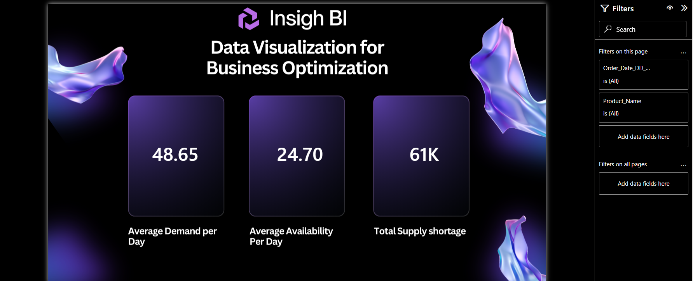
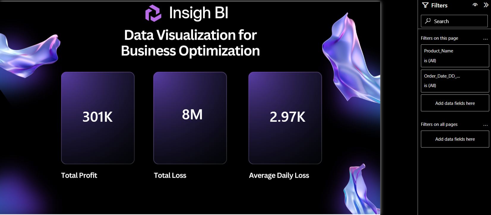

# Sales & Inventory Analysis Dashboard

## Project Overview

This project analyzes product demand and inventory availability using SQL Server and Power BI. Data from multiple sources was imported into SQL Server, integrated using SQL joins, and transformed into a consolidated table for reporting and visualization.

The objective of this project is to monitor inventory levels, identify product demand patterns, and generate insights that support inventory planning and business decision-making.

## Tools & Technologies

* SQL Server
* SQL
* Power BI
* CSV Files

## Data Sources

* Products.csv
* Test_Environment_Inventory_Dataset.csv

## Project Workflow

1. Imported product and inventory datasets into SQL Server.
2. Joined both datasets using `Product_ID`.
3. Created a consolidated table (`dbo.new_table`) for analysis.
4. Performed SQL-based data validation and analysis.
5. Connected SQL Server data to Power BI.
6. Developed an interactive dashboard to visualize inventory and demand metrics.

## SQL Analysis Performed

* Product-wise demand analysis
* Average demand calculation
* Inventory availability analysis
* Product pricing analysis
* Demand trend analysis
* Aggregate reporting using SQL functions

## Dashboard Features

### Page 1 – Inventory Overview

* Product Demand Analysis
* Inventory Availability Overview
* Product Performance KPIs
* Interactive Filters and Slicers

### Page 2 – Detailed Analysis

* Demand Trend Analysis
* Product-Level Insights
* Inventory Monitoring
* Interactive Visualizations

## Key Insights

* Identified products with the highest demand.
* Analyzed inventory availability across products.
* Tracked demand patterns over time.
* Supported inventory planning through data-driven insights.

## Repository Structure

```text
Products.csv
Test_Environment_Inventory_Dataset.csv
Sales_Inventory_Analysis_SQL.sql
Sales_Inventory_Analysis_Dashboard.pbix
Dashboard_Page_1.png
Dashboard_Page_2.png
README.md
```

## Dashboard Preview

### Dashboard Page 1



### Dashboard Page 2



## 👨‍💻 Author

**Aditya Sakhuja**

LinkedIn: https://www.linkedin.com/in/aditya-sakhuja-508b33274/

GitHub: https://github.com/AdityaSakhuja18

---

## ⭐ Project Impact

This project is part of my Data Analytics portfolio and demonstrates how data from multiple sources can be integrated using SQL Server and transformed into actionable business insights through Power BI. The analysis helps identify product demand patterns, monitor inventory availability, and support data-driven inventory planning and decision-making.
